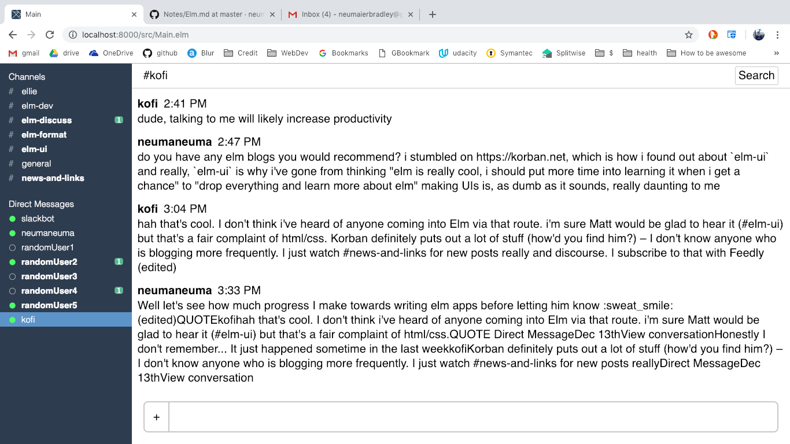

# SlackElm
This is a Slack clone created using Elm and the `elm-ui` library. This is my introductory project to Elm. I came through a strange route... through `elm-ui`! Personally I found creating layouts and styles in HTML and CSS super confusing. Once I discovered `elm-ui` I found that both became super intuitive! And since `elm-ui` is a, you know, Elm library I had to learn Elm as well.

This is still a work in progress. My eventual goal is to replicate a large part of the UI, but only use an echo server as a back-end (so it won't actually be a functioning Slack client). Here is the current state of the GUI:

